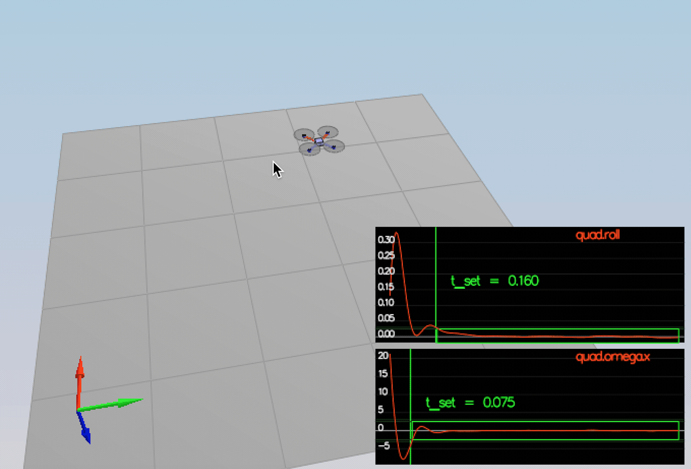
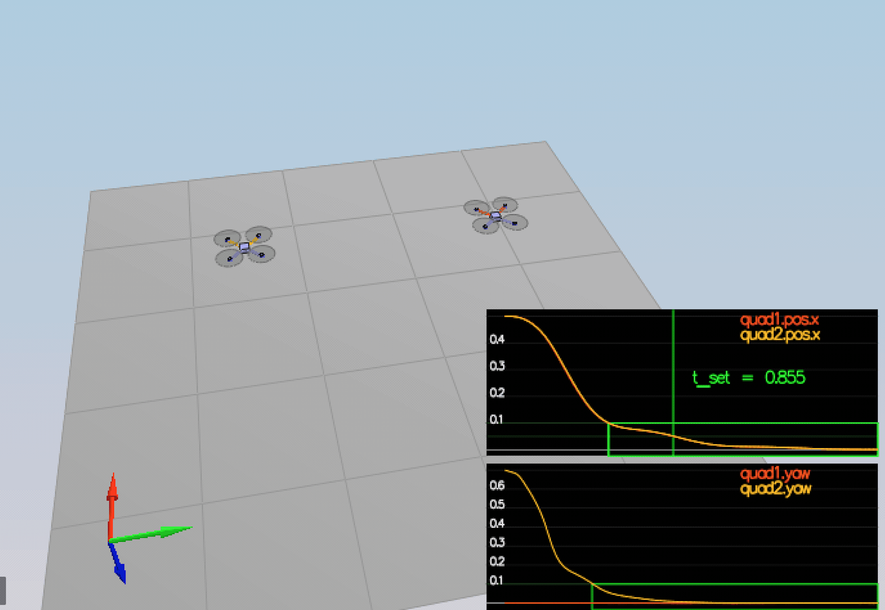
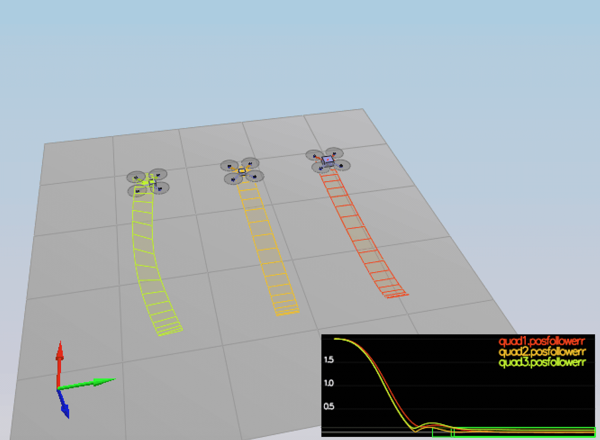
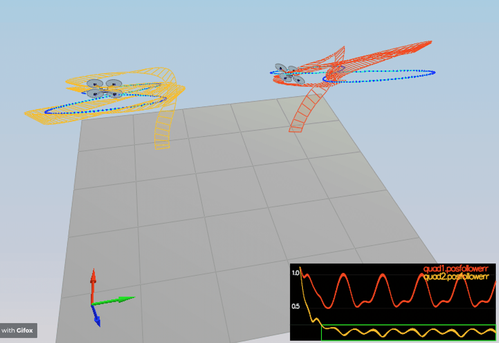

# FCND Control Writeup

## Criterion 1: Implemented body rate control in C++.

I have implemented a proportional controller on body rates to commanded moments. The controller can take into account the moments of inertia of the drone when calculating the commanded moments.

### implement the code in the function `GenerateMotorCommands()`

```c++
////////////////////////////// BEGIN STUDENT CODE ///////////////////////////

  /*
  cmd.desiredThrustsN[0] = mass * 9.81f / 4.f; // front left
  cmd.desiredThrustsN[1] = mass * 9.81f / 4.f; // front right
  cmd.desiredThrustsN[2] = mass * 9.81f / 4.f; // rear left
  cmd.desiredThrustsN[3] = mass * 9.81f / 4.f; // rear right
  */
    
    float l = L / sqrtf(2.f);
    float t1 = momentCmd.x / l;
    float t2 = momentCmd.y / l;
    float t3 = - momentCmd.z / kappa;
    float t4 = collThrustCmd;
    
    cmd.desiredThrustsN[0] = (t1 + t2 + t3 + t4)/4.f;  // front left  - f1
    cmd.desiredThrustsN[1] = (-t1 + t2 - t3 + t4)/4.f; // front right - f2
    cmd.desiredThrustsN[2] = (t1 - t2 - t3 + t4)/4.f ; // rear left   - f4
    cmd.desiredThrustsN[3] = (-t1 - t2 + t3 + t4)/4.f; // rear right  - f3

/////////////////////////////// END STUDENT CODE ////////////////////////////
```

### implement the code in the function `BodyRateControl()`

```c++
////////////////////////////// BEGIN STUDENT CODE ///////////////////////////
    V3F I;
    I.x = Ixx;
    I.y = Iyy;
    I.z = Izz;
    momentCmd = I * kpPQR * ( pqrCmd - pqr );
/////////////////////////////// END STUDENT CODE ////////////////////////////
```

### Tune `kpPQR` in `QuadControlParams.txt` to get the vehicle to stop spinning quickly but not overshoot

I tripled the gain as follows.

```
# Angle rate gains
# kpPQR = 23, 23, 5
kpPQR = 69, 69, 15
```

## Criterion 2: Implement roll pitch control in C++.

The controller uses the acceleration and thrust commands, in addition to the vehicle attitude to output a body rate command. The controller accounts for the non-linear transformation from local accelerations to body rates. The drone's mass has be accounted for when calculating the target angles.

### implement the code in the function `RollPitchControl()`

```c
////////////////////////////// BEGIN STUDENT CODE ///////////////////////////
    if ( collThrustCmd > 0 ) {
        float c = - collThrustCmd / mass;
        float b_x_cmd = CONSTRAIN(accelCmd.x / c, -maxTiltAngle, maxTiltAngle);
        float b_x_err = b_x_cmd - R(0,2);
        float b_x_p_term = kpBank * b_x_err;
        
        float b_y_cmd = CONSTRAIN(accelCmd.y / c, -maxTiltAngle, maxTiltAngle);
        float b_y_err = b_y_cmd - R(1,2);
        float b_y_p_term = kpBank * b_y_err;
        
        pqrCmd.x = (R(1,0) * b_x_p_term - R(0,0) * b_y_p_term) / R(2,2);
        pqrCmd.y = (R(1,1) * b_x_p_term - R(0,1) * b_y_p_term) / R(2,2);
    } else {
        pqrCmd.x = 0.0;
        pqrCmd.y = 0.0;
    }
    
    pqrCmd.z = 0;
/////////////////////////////// END STUDENT CODE ///////////////////////////
```

### Tune `kpBank` in `QuadControlParams.txt` to minimize settling time but avoid too much overshoot

I doubled the gain.

```
# Angle control gains
# kpBank = 5
kpBank = 10
```

## Criterion 3: Implement altitude controller in C++.

The controller uses both the down position and the down velocity to command thrust. Notice that:

* the output value is indeed thrust (the drone's mass has been accounted for), and that 
* the thrust includes the non-linear effects from non-zero roll/pitch angles.

Additionally, the C++ altitude controller contains an integrator to handle the weight non-idealities presented in scenario 4.

### implement the code in the function `AltitudeControl()`

```c
////////////////////////////// BEGIN STUDENT CODE ///////////////////////////
    float z_err = posZCmd - posZ;
    float p_term = kpPosZ * z_err;
    
    float z_dot_err = velZCmd - velZ;
    integratedAltitudeError += z_err * dt; //This has been added.
    
    
    float d_term = kpVelZ * z_dot_err + velZ;
    float i_term = KiPosZ * integratedAltitudeError;
    float b_z = R(2,2);
    
    float u_1_bar = p_term + d_term + i_term + accelZCmd;
    
    float acc = ( u_1_bar - CONST_GRAVITY ) / b_z;
    
    thrust = - mass * CONSTRAIN(acc, - maxAscentRate / dt, maxAscentRate / dt);
/////////////////////////////// END STUDENT CODE ////////////////////////////
```

## Criterion 4: Implement lateral position control in C++.

The controller uses the local NE position and velocity to generate a commanded local acceleration.

### implement the code in the function `LateralPositionControl()`

```c
////////////////////////////// BEGIN STUDENT CODE ///////////////////////////
    V3F kpPos;
    kpPos.x = kpPosXY;
    kpPos.y = kpPosXY;
    kpPos.z = 0.f;
    
    V3F kpVel;
    kpVel.x = kpVelXY;
    kpVel.y = kpVelXY;
    kpVel.z = 0.f;
    
    V3F capVelCmd;
    if ( velCmd.mag() > maxSpeedXY ) {
        capVelCmd = velCmd.norm() * maxSpeedXY;
    } else {
        capVelCmd = velCmd;
    }
    
    accelCmd = kpPos * ( posCmd - pos ) + kpVel * ( capVelCmd - vel ) + accelCmd;
    
    if ( accelCmd.mag() > maxAccelXY ) {
        accelCmd = accelCmd.norm() * maxAccelXY;
    }
/////////////////////////////// END STUDENT CODE ////////////////////////////
```

### tune parameters kpPosXY and kpPosZ

```
# Position control gains
# kpPosXY = 1
kpPosXY = 32
# kpPosZ = 1
kpPosZ = 32
```

### tune parameters kpVelXY and kpVelZ

```
# Velocity control gains
# kpVelXY = 4
kpVelXY = 12
# kpVelZ = 4
kpVelZ = 12
```

## Criterion 5: Implement yaw control in C++.

### implement the code in the function `YawControl()`

```c
////////////////////////////// BEGIN STUDENT CODE ///////////////////////////
    float yaw_cmd_2_pi = 0;
    if ( yawCmd > 0 ) {
        yaw_cmd_2_pi = fmodf(yawCmd, 2 * F_PI);
    } else {
        yaw_cmd_2_pi = -fmodf(-yawCmd, 2 * F_PI);
    }
    float err = yaw_cmd_2_pi - yaw;
    if ( err > F_PI ) {
        err -= 2 * F_PI;
    } if ( err < -F_PI ) {
        err += 2 * F_PI;
    }
    yawRateCmd = kpYaw * err;


/////////////////////////////// END STUDENT CODE ////////////////////////////
```

### tune parameters `kpYaw` and the 3rd (z) component of `kpPQR`

```
＃kpYaw = 1
kpYaw = 4

# Angle rate gains
# kpPQR = 23, 23, 5
kpPQR = 69, 69, 15
```

## Criterion 6:  Implement calculating the motor commands given commanded thrust and moments in C++.

The thrust and moments have been converted to the appropriate 4 different desired thrust forces for the moments. The dimensions of the drone are properly accounted for when calculating thrust from moments.

## Flight Evaluation

### The scenario #2 test is passed.

```
(../config/2_AttitudeControl.txt)
PASS: ABS(Quad.Roll) was less than 0.025000 for at least 0.750000 seconds
PASS: ABS(Quad.Omega.X) was less than 2.500000 for at least 0.750000 seconds
```



### The scenario #3 test is passed.

```
(../config/3_PositionControl.txt)
PASS: ABS(Quad1.Pos.X) was less than 0.100000 for at least 1.250000 seconds
PASS: ABS(Quad2.Pos.X) was less than 0.100000 for at least 1.250000 seconds
PASS: ABS(Quad2.Yaw) was less than 0.100000 for at least 1.000000 seconds
```



### The scenario #4 test is passed.

```
(../config/4_Nonidealities.txt)
PASS: ABS(Quad1.PosFollowErr) was less than 0.100000 for at least 1.500000 seconds
PASS: ABS(Quad2.PosFollowErr) was less than 0.100000 for at least 1.500000 seconds
PASS: ABS(Quad3.PosFollowErr) was less than 0.100000 for at least 1.500000 seconds
```



### The scenario #5 test is passed.

```
(../config/5_TrajectoryFollow.txt)
PASS: ABS(Quad2.PosFollowErr) was less than 0.250000 for at least 3.000000 seconds
```


